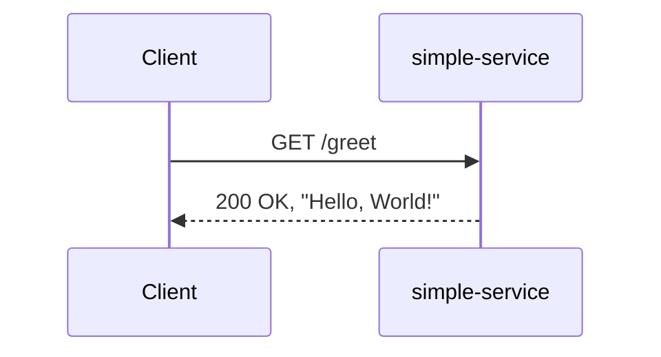
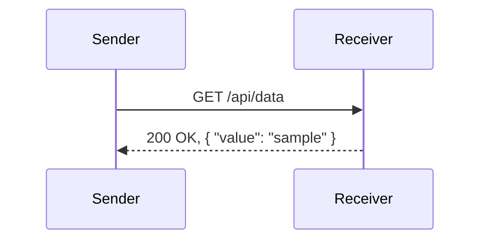
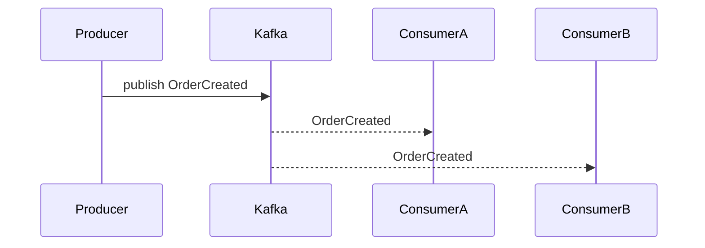

## Microservices With Spring Boot And Spring Cloud [](https://twitter.com/piotr_minkowski)

[](https://circleci.com/gh/piomin/course-spring-microservices)

[](https://sonarcloud.io/dashboard?id=piomin_course-spring-microservices)
[](https://sonarcloud.io/dashboard?id=piomin_course-spring-microservices)
[](https://sonarcloud.io/dashboard?id=piomin_course-spring-microservices)
[](https://sonarcloud.io/dashboard?id=piomin_course-spring-microservices)

That is repository with examples used for video course _Microservices With Spring Boot And Spring Cloud_.

### Requirements
To run the example applications you need to have installed:
1. Intellij IDEA
2. JDK 11+
3. Maven

### Structure
Each directory in the root project is related with the single part of the course.

[Part 1 - Introduction to Spring Boot](https://www.youtube.com/watch?v=KnbH4hOswLA)
- intro-to-spring-boot

[Part 2 - Distributed configuration & service discovery](https://www.youtube.com/watch?v=laI2yxthk3c)
- config-and-discovery

[Part 3 - Inter-service communication](https://www.youtube.com/watch?v=EJUtU_VGpuk)
- inter-communication

[Part 4 - API Gateway](https://www.youtube.com/watch?v=XIkSWHX38Tg)
- api-gateway

[Part 5 - Event-driven microservices](https://www.youtube.com/watch?v=fwhP9k0e1BY)
- event-driven

## Overview
This repository showcases a set of Spring Cloud sample applications that demonstrate core patterns and best practices for building microservices with Spring Boot, Spring Cloud Gateway, Eureka Discovery, Config Server, OpenFeign, and Kafka/Spring Cloud Stream. Each module provides hands-on examples for common cloud-native scenarios, enabling developers to explore and adapt these patterns in their own projects.

## Prerequisites
* JDK 17+
* Maven 3.9+
* Docker & Docker Compose (optional)

## Module Architecture

| Module                  | Services                                                      | Ports            |
|-------------------------|---------------------------------------------------------------|------------------|
| intro-to-spring-boot    | simple-service                                                | 8080             |
| inter-communication      | sender-service, receiver-service                             | 8080             |
| event-driven             | producer-service, consumer-a-service, consumer-b-service     | 8080             |
| api-gateway              | gateway-service                                              | 8080             |
| config-and-discovery     | config-server (8080), discovery-server (8761)                | 8080, 8761       |

### intro-to-spring-boot
• Purpose: A minimal Spring Boot application demonstrating a simple RESTful endpoint.  
• Tech stack: Spring Boot, Spring Web.  
• Services:

| Service        | Port | Description                              |
|----------------|------|------------------------------------------|
| simple-service | 8080 | Returns a greeting message via REST API. |



### inter-communication
• Purpose: Illustrates synchronous service-to-service calls using OpenFeign.  
• Tech stack: Spring Boot, Spring Web, Spring Cloud OpenFeign.  
• Services:

| Service          | Port | Description                                         |
|------------------|------|-----------------------------------------------------|
| sender-service   | 8080 | Calls receiver-service using a Feign client.        |
| receiver-service | 8080 | Exposes an endpoint that returns sample data.       |



### event-driven
• Purpose: Demonstrates asynchronous messaging with Kafka and Spring Cloud Stream.  
• Tech stack: Spring Boot, Spring Cloud Stream, Kafka Binder.  
• Services:

| Service             | Port | Description                                  |
|---------------------|------|----------------------------------------------|
| producer-service    | 8080 | Publishes events to a Kafka topic.           |
| consumer-a-service  | 8080 | Listens to topic and processes messages.     |
| consumer-b-service  | 8080 | Listens to topic and processes messages.     |



### api-gateway
• Purpose: Serves as the edge router for all incoming requests.  
• Tech stack: Spring Boot, Spring Cloud Gateway.  
• Services:

| Service          | Port | Description                                      |
|------------------|------|--------------------------------------------------|
| gateway-service  | 8080 | Routes requests to downstream microservices.     |

### config-and-discovery
• Purpose: Centralized configuration and service registration/discovery.  
• Tech stack: Spring Boot, Spring Cloud Config, Spring Cloud Netflix Eureka.  
• Services:

| Service           | Port | Description                                                   |
|-------------------|------|---------------------------------------------------------------|
| config-server     | 8080 | Serves configuration properties to client applications.       |
| discovery-server  | 8761 | Registers and discovers microservices via Eureka Dashboard.   |

## Running the Examples
1. Start Config Server:  
   mvn -pl config-and-discovery/config-server spring-boot:run  
2. Start Discovery Server (Eureka) on port 8761:  
   mvn -pl config-and-discovery/discovery-server spring-boot:run  
3. Start API Gateway:  
   mvn -pl api-gateway/gateway-service spring-boot:run  
4. Start each remaining service (choose order as needed):  
   mvn -pl <module>/<service> spring-boot:run  
   
Alternative (Docker Compose):  
```bash
docker-compose -f docker-compose.yml up
```  
(Note: docker-compose.yml not included by default; add one if desired.)

## Testing the Services
* simple-service:  
  ```bash
  curl http://localhost:8080/greet
  ```
* sender-service → receiver-service:  
  ```bash
  curl http://localhost:8080/send?msg=hello
  ```
* producer-service → consumers:  
  ```bash
  curl -X POST http://localhost:8080/orders -H "Content-Type: application/json" -d '{"id":123}'
  ```
* API Gateway routing:  
  ```bash
  curl http://localhost:8080/api/simple/greet
  ```

## Contributing
Contributions are welcome! Please submit pull requests with clear descriptions of changes. Each module is organized to demonstrate specific Spring Cloud components (Web, Feign, Kafka Binder, Config, Eureka, Gateway). Ensure that code adheres to existing style and patterns. 

## License
This project is licensed under the MIT License. See the LICENSE file for details.
